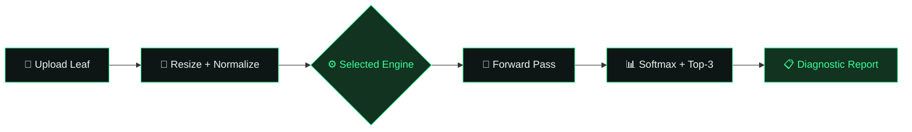

<div align="center">


<a href="https://huggingface.co/spaces/deepak0027/plant-disease-classifier">
  
</a>

<br/>


<br/>

[](https://huggingface.co/spaces/deepak0027/plant-disease-classifier)
[](https://huggingface.co/spaces/deepak0027/plant-disease-classifier)

<br/>


<br/>

### *A comprehensive deep learning research project comparing 8 state-of-the-art architectures for automated crop disease detection*


</div>

<div align="center">

```diff
+ Robustness stress-testing   + Grad-CAM explainability   + Live ensemble consensus
+ 8 rival architectures       + Interactive Gradio UI     + One-click dataset gallery
```

</div>


## 📑 Table of Contents

<details open>
<summary><b>Click to expand / collapse</b></summary>

- [📌 Project Overview](#-project-overview)
- [🏗️ Architectures Compared](#️-architectures-compared)
- [📊 Dataset](#-dataset)
- [🔬 Methodology](#-methodology)
- [📈 Results Summary](#-results-summary)
- [📁 Project Structure](#-project-structure)
- [🚀 How to Run](#-how-to-run)
- [🛠️ Requirements](#️-requirements)
- [🎮 Interactive Demo](#-interactive-demo)
- [🗺️ Notebook Walkthrough](#️-notebook-walkthrough)
- [💡 Key Insights](#-key-insights)
- [🤝 Acknowledgements](#-acknowledgements)
- [📬 Connect](#-connect)

</details>


## 📌 Project Overview

This project builds and evaluates **8 different deep learning models** on the PlantVillage dataset to classify **38 plant disease categories** across multiple crop species. Beyond simple classification, the project includes:

- 🌪️ **Robustness stress testing** using Gaussian noise
- 🔥 **Explainability** via Grad-CAM heatmaps (visualizing what the model "sees")
- 🎮 **Interactive demo dashboards** built with both `ipywidgets` and `Gradio`
- ⚔️ A **head-to-head battle** between CNN-based models and Vision Transformers (ViT)

> **The end goal:** find which architecture delivers the best accuracy, generalization, and real-world robustness for agricultural AI.

<div align="center">



</div>


## 🏗️ Architectures Compared

<div align="center">

| # | Model | Type | Input Size | Optimizer | LR |
|:-:|-------|------|:-----------:|:-----------:|:-----:|
| 1 | **EfficientNet-B0** | CNN (Baseline) | 224×224 | Adam | `0.001` |
| 2 | **Swin Transformer** | Vision Transformer | 224×224 | Adam | `5e-5` |
| 3 | **ResNet-50** | CNN | 224×224 | Adam | `0.001` |
| 4 | **DenseNet-121** | CNN | 224×224 | Adam | `0.0005` |
| 5 | **Inception-V3** | CNN | 299×299 | Adam | `0.001` |
| 6 | **MobileNet-V3 Large** | Lightweight CNN | 224×224 | Adam | `0.001` |
| 7 | **VGG-16** | Classic Deep CNN | 224×224 | Adam | `0.0001` |
| 8 | **ConvNeXt-Tiny** 🏆 | Modern CNN | 224×224 | AdamW | `0.001` |

</div>

> All models use **Transfer Learning** — pre-trained on ImageNet, with frozen backbones and fine-tuned classification heads.


## 📊 Dataset

<div align="center">

**PlantVillage Dataset** — one of the most widely used datasets in agricultural AI research.

| Detail | Info |
|--------|------|
| Source | [Kaggle — PlantVillage Dataset](https://www.kaggle.com/datasets/abdallahalidev/plantvillage-dataset) |
| Total Classes | **38** (plant–disease combinations) |
| Image Type | Color (RGB) |
| Input Format | `ImageFolder` (PyTorch) |
| Train / Val Split | **80% / 20%** |
| Batch Size | 32 |

</div>

### 🌱 Supported Plant Species

<div align="center">

   -1c8a5c?style=flat-square)   

      

</div>


## 🔬 Methodology

<details open>
<summary><b>1️⃣ Data Preprocessing</b></summary>

```python
transforms.Resize((224, 224))         # Resize to model input
transforms.ToTensor()                  # Convert to tensor
transforms.Normalize(                  # ImageNet normalization
    mean=[0.485, 0.456, 0.406],
    std=[0.229, 0.224, 0.225]
)
```
> Inception-V3 uses `299×299` instead of `224×224`.

</details>

<details>
<summary><b>2️⃣ Transfer Learning Strategy</b></summary>

- Download ImageNet pre-trained weights
- **Freeze** backbone layers (keep learned low-level features)
- **Replace** the final classification head with `nn.Linear(features, 38)`
- Train **only the head** for fast convergence → then optionally unfreeze for full fine-tuning

</details>

<details>
<summary><b>3️⃣ Training Configuration</b></summary>

- **Loss Function:** `CrossEntropyLoss`
- **Epochs:** 10 per model
- **Hardware:** Kaggle GPU (CUDA)
- **History Tracked:** Training loss, Training accuracy, Validation accuracy per epoch

</details>

<details>
<summary><b>4️⃣ Robustness / Stress Test</b></summary>

Each trained model is evaluated under **Gaussian noise** (level = 0.2):

```python
noise = torch.randn_like(images) * 0.2
noisy_images = images + noise
```

This tests whether models generalize to real-world conditions like low-quality camera images, outdoor lighting variation, etc.

</details>

<details>
<summary><b>5️⃣ Explainability — Grad-CAM</b></summary>

Grad-CAM (Gradient-weighted Class Activation Mapping) generates **heatmaps** showing which regions of a leaf image the model focuses on when making predictions.

- **CNN Target Layer:** `cnn_model.features[-1]`
- **ViT Target Layer:** `vit_model.norm` (with reshape transform for Swin)

</details>


## 📈 Results Summary

<div align="center">

| Model | Best Val Accuracy | Final Train Loss |
|-------|:-----------------:|:----------------:|
| 🥇 ConvNeXt-Tiny | **99.13%**  | `0.0236` |
| 🥈 Swin Transformer | **98.10%**  | `0.0839` |
| 🥉 VGG-16 | **97.57%**  | `0.0323` |
| ResNet-50 | **97.01%**  | `0.0957` |
| DenseNet-121 | **96.74%**  | `0.2030` |
| MobileNet-V3 | **96.69%**  | `0.0808` |
| EfficientNet-B0 | **96.54%**  | `0.1466` |
| Inception-V3 | **93.60%**  | `0.5975` |

</div>

> **🧪 Hypothesis tested:** *Vision Transformers are more robust to image noise than CNNs due to their global attention mechanism.*


## 📁 Project Structure

```
plant-disease-classifier/
│
├── plant-diseases-classification-system.ipynb   # Main notebook (all models)
│
├── saved_models/                                # Trained model weights (.pth)
│   ├── cnn_baseline_plantvillage_10epochs.pth
│   ├── swin_final_plantvillage_10epochs.pth
│   ├── resnet50_plantvillage_final.pth
│   ├── densenet121_plantvillage_final.pth
│   ├── inceptionv3_plantvillage.pth
│   ├── mobilenetv3_plantvillage.pth
│   ├── vgg16_plantvillage.pth
│   └── convnext_tiny_plantvillage.pth
│
├── history/                                     # Training history (.npy)
│   ├── cnn_history.npy
│   ├── swin_history.npy
│   ├── resnet_history1.npy
│   ├── densenet_history.npy
│   ├── inception_history.npy
│   ├── mobilenet_history.npy
│   ├── vgg_history.npy
│   └── convnext_history.npy
│
├── requirements.txt
└── README.md
```

> ⚠️ `.pth` model files are **not included** in this repo due to GitHub's 100MB file limit. Re-train using the notebook or download from Kaggle outputs.


## 🚀 How to Run

<details open>
<summary><b>🅰️ Option 1 — Run on Kaggle (Recommended · Free GPU)</b></summary>

1. Go to [Kaggle.com](https://www.kaggle.com) and create an account
2. Click **"+ New Notebook"**
3. Add the PlantVillage dataset: click **"Add Data"** → search `PlantVillage`
4. Upload and run `plant-diseases-classification-system.ipynb`
5. Enable **GPU** under Settings → Accelerator → GPU T4 x2

</details>

<details>
<summary><b>🅱️ Option 2 — Run Locally</b></summary>

```bash
# 1. Clone the repo
git clone https://github.com/YOUR_USERNAME/plant-disease-classifier.git
cd plant-disease-classifier

# 2. Install dependencies
pip install -r requirements.txt

# 3. Download the PlantVillage dataset from Kaggle
# Place it at: /data/plantvillage/color/

# 4. Open the notebook
jupyter notebook plant-diseases-classification-system.ipynb
```

</details>


## 🛠️ Requirements

```txt
torch>=2.0.0
torchvision>=0.15.0
numpy
matplotlib
Pillow
scikit-learn
seaborn
pandas
ipywidgets
gradio
grad-cam
```

Install all at once:
```bash
pip install -r requirements.txt
```


## 🎮 Interactive Demo

This project includes **two interactive demo UIs**:

<table>
<tr>
<td width="50%" valign="top">

### 🔹 ipywidgets Dashboard
*(Kaggle Notebook)*
- Upload any leaf image directly inside the notebook
- Get instant prediction + confidence score
- Works inline in Kaggle / Jupyter

</td>
<td width="50%" valign="top">

### 🔹 Gradio Multi-Engine Dashboard
```python
demo.launch(share=True)  # public link!
```
- Choose from **all 8 trained engines** via dropdown
- Enterprise-grade dark-themed diagnostic cards
- 🟢 Healthy · 🔴 Disease Detected
- Confidence bar + recommended action

</td>
</tr>
</table>


## 🗺️ Notebook Walkthrough

<details>
<summary><b>Click to expand the full step-by-step notebook flow</b></summary>

| Section | What Happens |
|---------|-------------|
| **Setup & GPU Check** | Detects CUDA, auto-finds dataset path |
| **Noise Visualization** | Side-by-side: clean vs Gaussian-noisy leaf |
| **Data Pipeline** | ImageFolder → random 80/20 split → DataLoaders |
| **EfficientNet-B0 Training** | CNN baseline, 10 epochs, saves `.pth` + `.npy` |
| **Swin Transformer Training** | Full unfreeze, lr=5e-5, 10 epochs |
| **ResNet-50 Training** | Frozen backbone + Dropout head |
| **DenseNet-121 Training** | Feature reuse architecture |
| **Inception-V3 Training** | Special 299×299 loader, aux_logits disabled |
| **MobileNet-V3 Training** | Lightweight model for edge deployment |
| **VGG-16 Training** | Classic deep CNN with multi-GPU support |
| **ConvNeXt-Tiny Training** | AdamW optimizer, modern architecture |
| **Results Table** | Master comparison of all 8 models |
| **Visualization** | Bar charts + learning curves for top models |
| **Noise Stress Test** | CNN vs ViT robustness comparison |
| **Grad-CAM Heatmaps** | Visual explainability for both models |
| **Gradio App** | Production-ready 8-engine diagnostic dashboard |

</details>


## 💡 Key Insights

- 🥇 **ConvNeXt-Tiny** achieves the highest accuracy — a modern CNN that borrows design ideas from Vision Transformers
- 👁️ **Swin Transformer** shows superior robustness on noisy images compared to traditional CNNs — global attention mechanisms help generalize better
- 📱 **MobileNet-V3** is the best pick for edge devices (IoT, mobile phones) due to its lightweight size
- 📦 **VGG-16**, despite being older, still performs competitively on well-structured datasets like PlantVillage
- 🔥 **Grad-CAM** confirms that ViT models focus more holistically on the leaf structure, while CNNs sometimes latch onto irrelevant texture patterns


## 🤝 Acknowledgements

<div align="center">

[](https://www.kaggle.com/datasets/abdallahalidev/plantvillage-dataset)
[](https://pytorch.org/)
[](https://github.com/jacobgil/pytorch-grad-cam)
[](https://gradio.app/)
[](https://www.kaggle.com/)

</div>


## 📬 Connect

<div align="center">

If you found this project helpful, feel free to ⭐ **star the repo** and connect!


<br/>

<i>Built with 🌿 and deep learning — for smarter, healthier crops.</i>


</div>
